**NO Copyright for the pictures used in the webpage.All copyright reserved with *Google Images***

# Yelp-Campgrounds

 ## *STACK USED* : 
 
 ####  Server        : Nodejs                
 ####  Database      : MongoDB
 ####  Cloud Platform: AWS

:page_facing_up: A website where a person can create his account using **Sign Up** option and then logging up using **Login** option. He can post details about various campgrounds all over the world including their pricing and details. He can also views details about campgrounds posted by other users and also **Comment** on them.

## Screenshots
 #### Screenshot 1

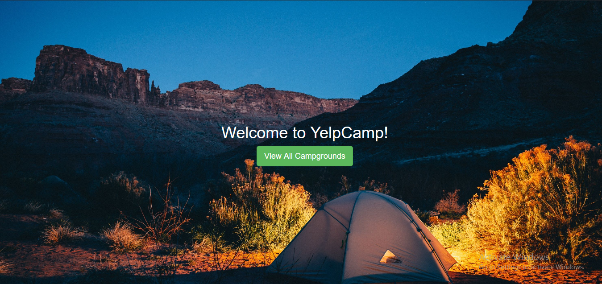

#### Screenshot 2

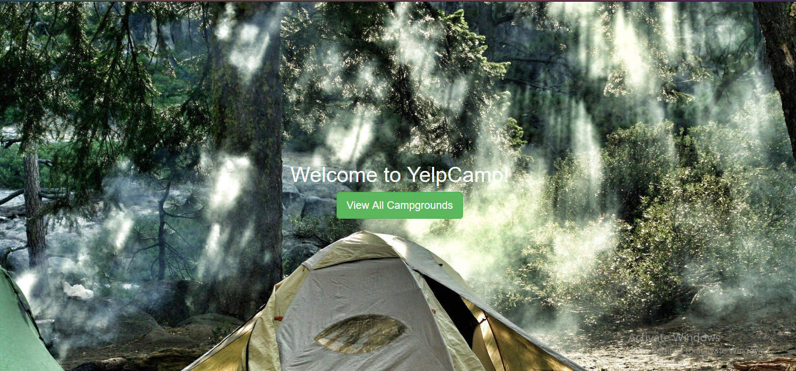

#### Screenshot 3

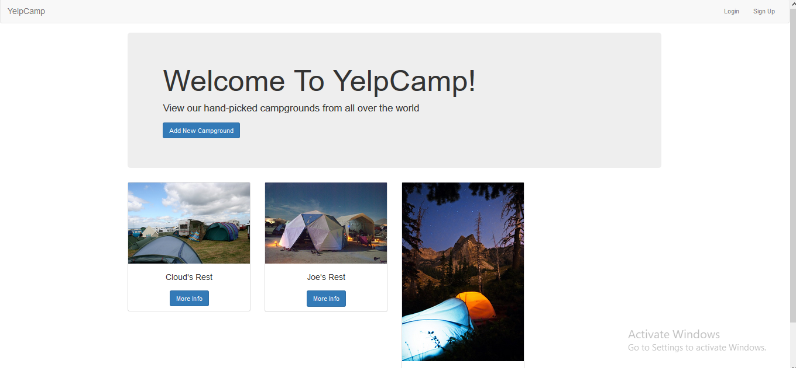

#### Screenshot 4

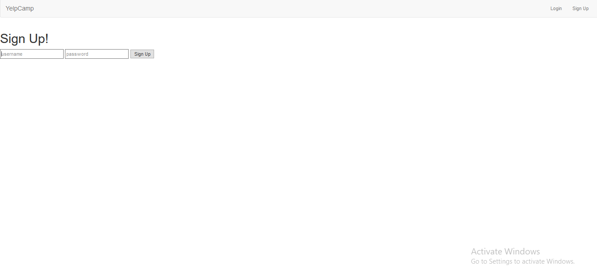

#### Screenshot 5

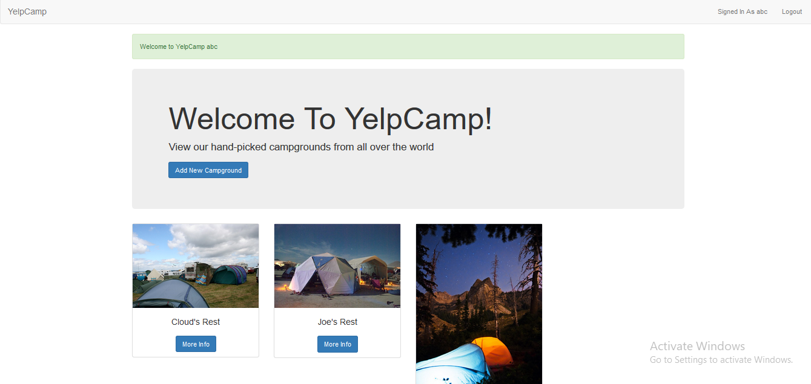

#### Screenshot 6

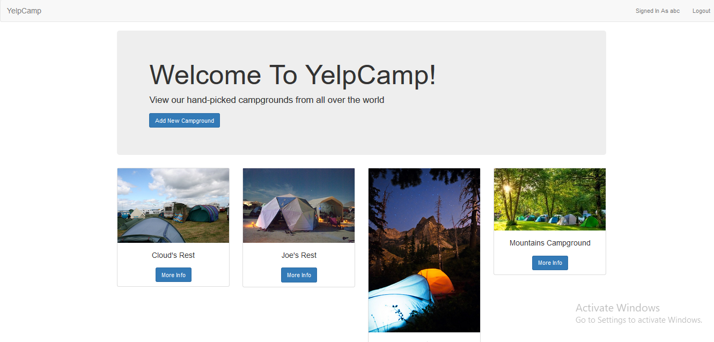

#### Screenshot 7

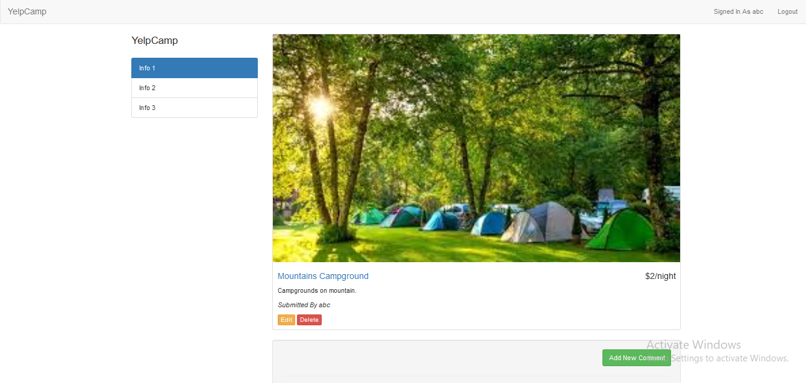

#### Screenshot 8

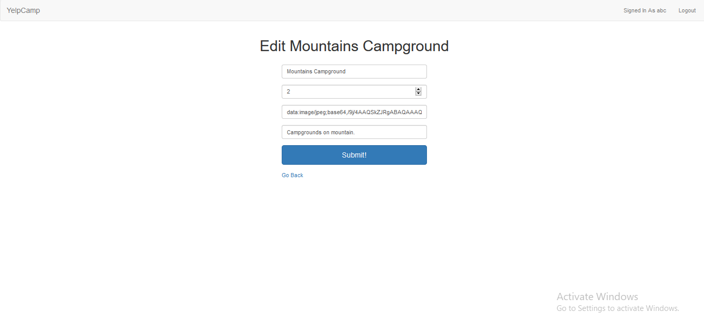

#### Screenshot 9

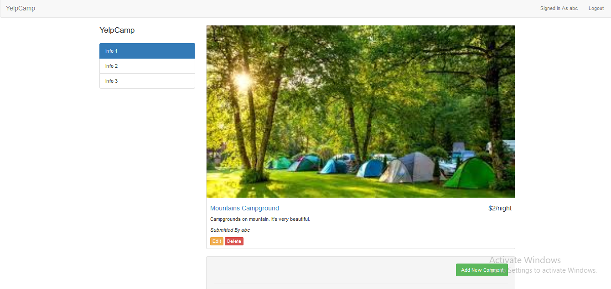

#### Screenshot 10

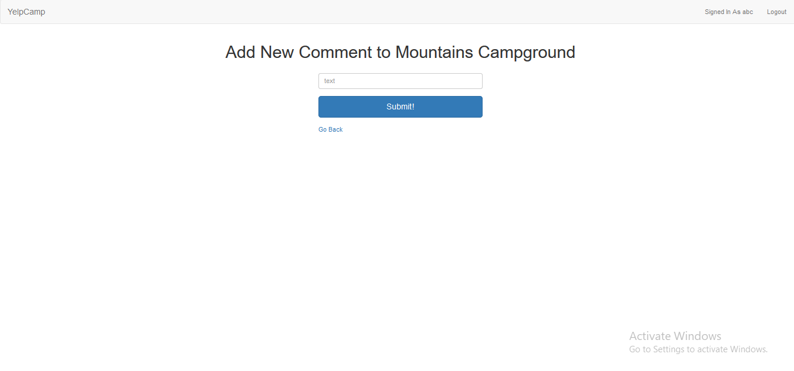

#### Screenshot 11

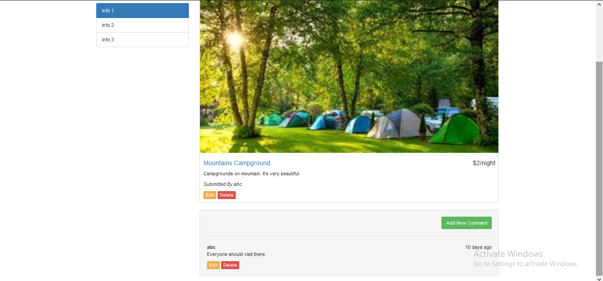

#### Screenshot 12

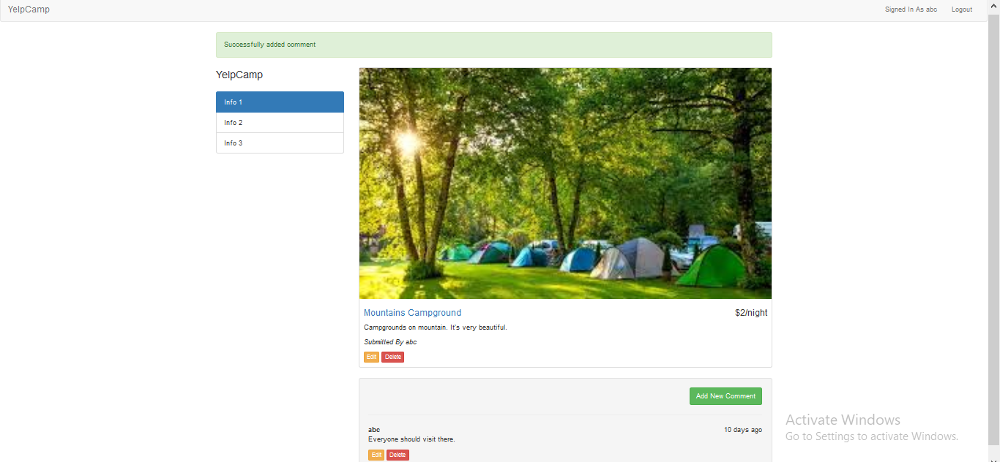

#### Screenshot 13

:pushpin: Deleted the new created campground and logged out.

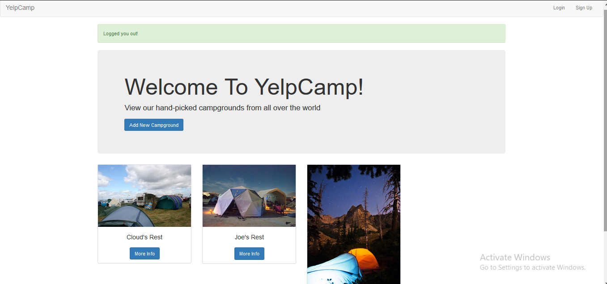
